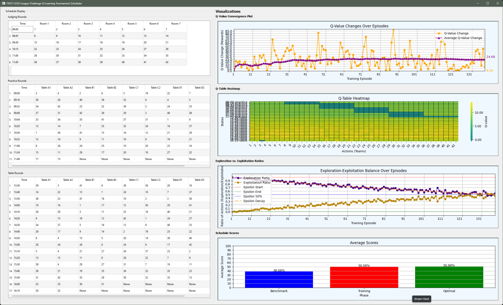

# FIRST LEGO League Challenge Q-Learning Event Scheduler

This project aims to develop a Python application using a Q-learning algorithm to automate and optimize the scheduling process for FIRST LEGO League Challenge events. The application is designed to address the inefficiencies of manual scheduling by ensuring fairness, adaptability, and transparency in event organization.

## Table of Contents

- [Languages Used](#languages-used)
- [Technologies Used](#technologies-used)
- [Installation](#installation)
- [Usage](#usage)
- [Features](#features)
- [Roadmap](#roadmap)
- [Contributing](#contributing)
- [License](#license)

## Languages Used

- Python

## Technologies Used

- Python's PySide6 for the GUI
- Other open-source Python libraries

## Installation

1. Ensure Python 3+ is installed on your system.
2. Download the application folder from the provided source.
3. Open a terminal or command prompt
4. Navigate to the application folder
5. Install necessary libraries via pip:
    - `pip install -r requirements.txt`

## Usage

### Running the Application

1. Go back to the open terminal or command prompt.
2. Navigate to the application's /src directory:
    - `cd src`
3. Run the main script:
    - `python main.py`

### Using the Application

1. Upon launch, the application will open its Graphical User Interface (GUI).

    - The title of the window should be “FIRST LEGO League Challenge QLearning Tournament Scheduler”

2. Start on the top left corner of the application with the “Schedule Data Inputs” group
of inputs.

    - Then move down the left side of the application until you have inputted all
    schedule parameters you would like.

    - Note: The application loads with default parameters that will begin to
    generate schedules, if you would like to see it generate some right away.

    - Important: The “GUI Refresh Rate” input tells the program how many training episodes it should run before updating the GUI with the current schedule, the Q-Value Convergence Plot, the Q-Table Heatmap, and the Exploration vs. Exploitation Ratios Plot. The default is set to “1”, but that may slow down your device if you train a large number of episodes

3. After inputting the required information, or leaving the inputs to their defaults, press
the "Train and then Generate Optimal Schedule" on the bottom left of the
application.

4. The application will process the inputs and execute three functions consecutively:

    - First it will generate 10 baseline schedules that do not have any soft
    constraints applied to them and have no effect on the Q-table. Its only
    function is to get an average baseline of what only the hard constraints and
    randomness can generate. This is to model how an inexperienced human
    scheduler may approach the problem.

    - Second, it will train by generating schedules given the inputs. It will train for
    as many iterations as there were inputted into the “Max Training episodes”
    box in the “Q-Learning Inputs” section.

    - Third, after the final training episode, it will use the Q-table it generated to
    output an optimal schedule.

    - Last, it will evaluate the optimal schedule, and aggregate evaluation
    statistics on every schedule produced above.33

5. Once finished, you may close the application window.

### Accessing the Outputs

1. To access the generated data and schedules, using your operating system’s file
browse, navigate to the “exports” folder in the application folder.

2. Each of the three subfolders contain useful information depending on what you
want to see:

    - To see aggregated data for every team of for the final schedule outputted in
    the benchmarks, training, and optimal schedule phases, open the
    “aggregate_stats” folder for a CSV file to clearly labeled for each.

    - To see simplified aggregated evaluation data across all phases, open the
    “schedule_evaluation” folder and open the “evaluation_results.csv” file.

    - To see all the training schedules generated during the models’ training
    episodes, open the “training_schedule_output” folder, which will contain a
    CSV schedule file for each episode.

3. Outside of the subfolders, there are three additional files:

    - To see the models Q-table, open “q_table.csv”. States and actions are
    paired with their Q-values.

    - To see the generated optimal schedule there are two options:

        - “optimal_schedule.csv” – contains the optimal schedule as a CSV
        file, formatted identically to the CSV files for the training schedules.

        - “grid_optimal_schedule.xlsx” – contains the optimal schedule as an
        Excel Workbook, with the three round types on different sheets. It is
        also organized as a grid, rather than a list, with times on the vertical
        and locations on the horizontal, with teams filling in the cells. This
        layout is identical to the conventional FLLC schedules and is what is
        displayed in the GUI in the center column, “Schedule Display”.

## Features

- Automated schedule generation using Q-learning.
- User-friendly GUI for ease of use by event organizers.
- Optimization for fairness and resource utilization.
- Visualizations for fine-tuning training.

## Roadmap

- Expand to real-world data usage with strict privacy measures.
- Enhance the model's adaptability to various event formats.

## Contributing

- Contributions for improving the algorithm and UI are welcome.

## License

[MIT License](LICENSE)
